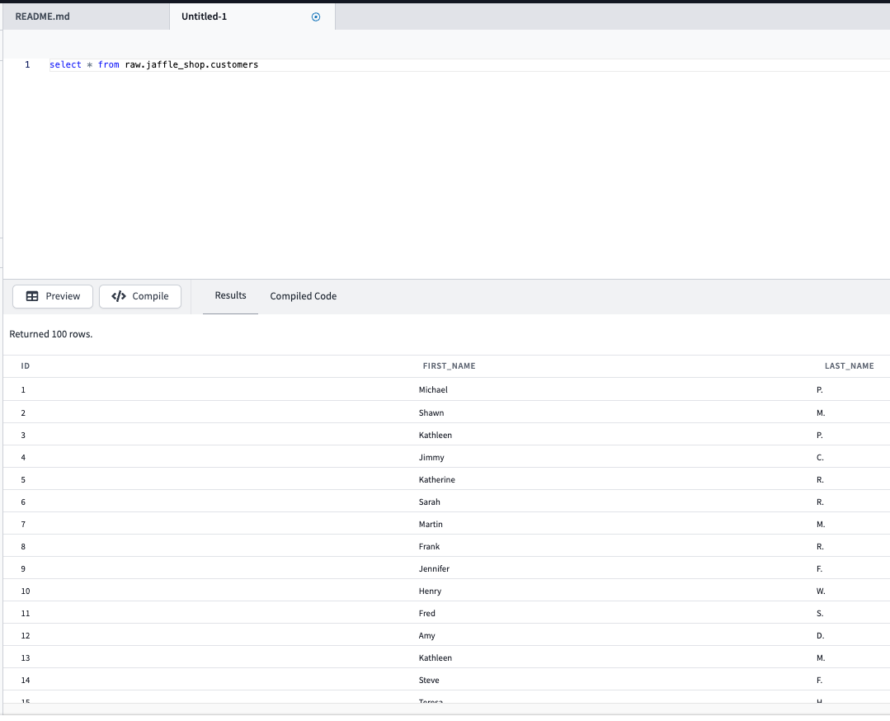
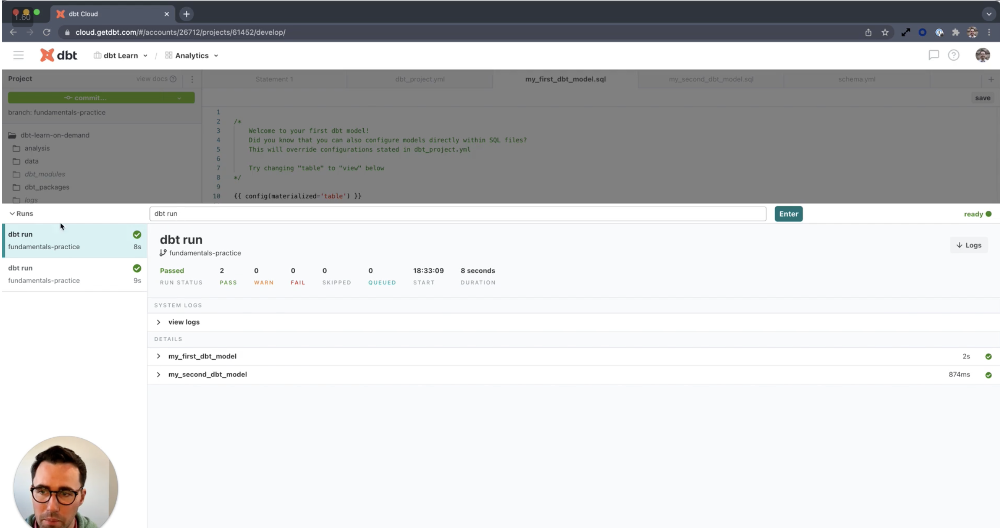
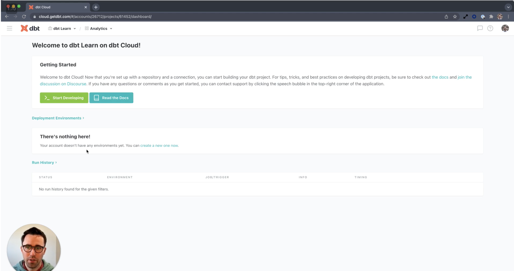
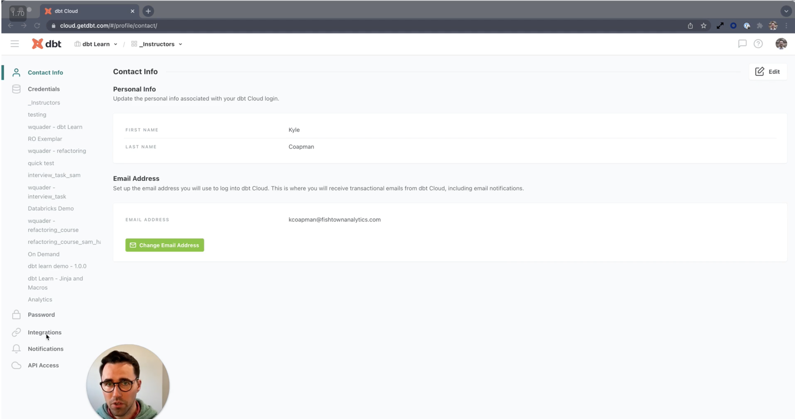

# Set up dbt Cloud

## Learning Objectives
Load training data into your data platform
Set up an empty repository and connect your GitHub account to dbt Cloud.
Set up your warehouse and repository connections.
Navigate the dbt Cloud IDE.
Complete a simple development workflow in the dbt Cloud IDE.

## dbt, data platforms, and version control

dbt Cloud is a hosted version that streamlines development with an online Integrated Development Environment (IDE) and an interface to run dbt on a schedule.
dbt Core is a command line tool that can be run locally.

https://docs.getdbt.com/docs/supported-data-platforms

Version control
https://docs.getdbt.com/docs/collaborate/git/managed-repository

## Setting up dbt Cloud and your data platform

we highly recommend getting access to one of the follow data platforms: BigQuery, Databricks, Redshift, or Snowflake.

https://docs.getdbt.com/docs/get-started/getting-started/set-up-dbt-cloud


https://docs.getdbt.com/docs/get-started/getting-started/getting-set-up/setting-up-snowflake

```sql

​​create table raw.jaffle_shop.customers 
( id integer,
  first_name varchar,
  last_name varchar
);

copy into raw.jaffle_shop.customers (id, first_name, last_name)
from 's3://dbt-tutorial-public/jaffle_shop_customers.csv'
file_format = (
  type = 'CSV'
  field_delimiter = ','
  skip_header = 1
  );

create table raw.jaffle_shop.orders
( id integer,
  user_id integer,
  order_date date,
  status varchar,
  _etl_loaded_at timestamp default current_timestamp
);

copy into raw.jaffle_shop.orders (id, user_id, order_date, status)
from 's3://dbt-tutorial-public/jaffle_shop_orders.csv'
file_format = (
  type = 'CSV'
  field_delimiter = ','
  skip_header = 1
  );

create table raw.stripe.payment 
( id integer,
  orderid integer,
  paymentmethod varchar,
  status varchar,
  amount integer,
  created date,
  _batched_at timestamp default current_timestamp
);

copy into raw.stripe.payment (id, orderid, paymentmethod, status, amount, created)
from 's3://dbt-tutorial-public/stripe_payments.csv'
file_format = (
  type = 'CSV'
  field_delimiter = ','
  skip_header = 1
  );
  
```


https://docs.getdbt.com/docs/get-started/getting-started/getting-set-up/setting-up-snowflake#connect-dbt-cloud-to-snowflake



## dbt Cloud IDE Overview

project

dbt_project.yml =  prj setup

models and tests = main folder

query result =  data results

compiled sql =  sql to be executed

lineage = models dep

yml =  configuration



commit changes to the branch

double __ used to  add macro  placeholder


## Overview of dbt Cloud UI



jobs and env

env =  where you run dbt



integrations  =  expand via api call to 3rrd party


