# Who is an analytics engineer?

## Learning Objectives

- traditional data team
- etl to elt
- analytics eng role
- dbt in modern data stacks
- structure of dbt project

## Traditional Data Teams

data analyst = query data
- close toi biz , build dashboard, xls ,sql 

data eng = build data platform and mantain the data
- sql  python and orch

there is a gap between them

## ETL and ELT

extract data from something, manipulate the data, server the data

tarditional etl = tools dev language and orchestartion 

now use of cloud based dwh instead of on premise 

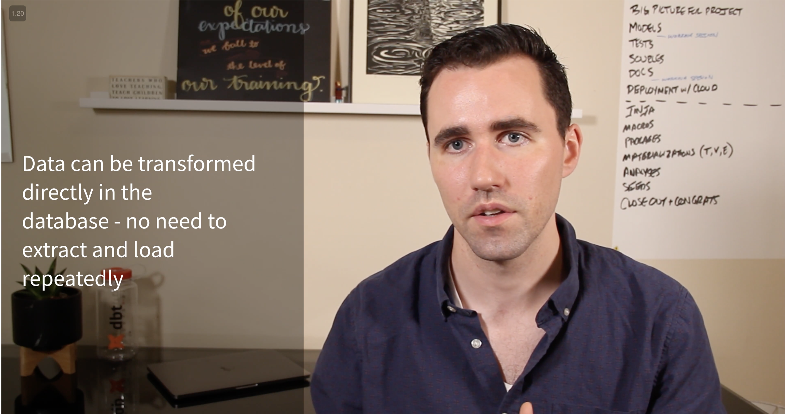

no E really anymore

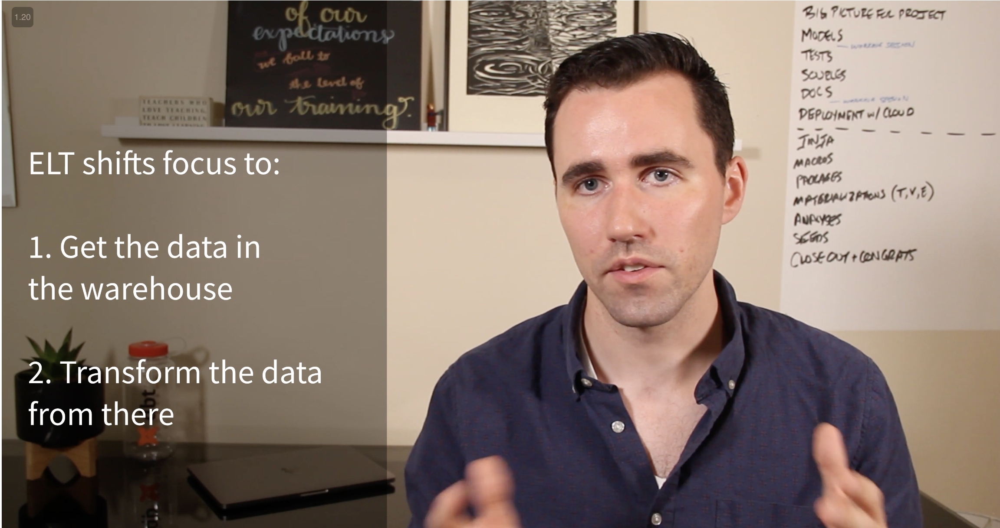

cloud based:
- scale compute
- scale storage
- reduction of transfer time

so now we moved from ETL to  ELT 

## Analytics Engineer

new role AE

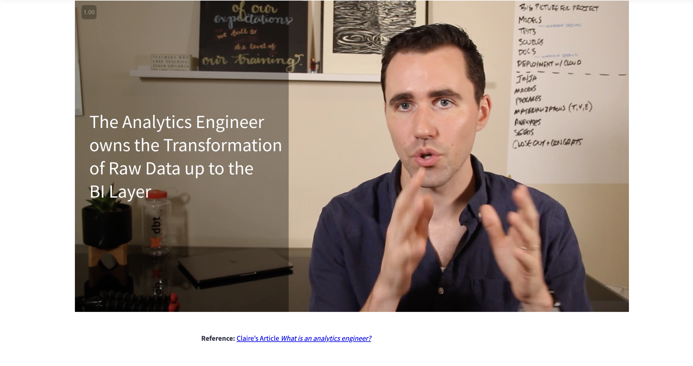

in charge of T
works closer to data analyst

data eng focus on the E L and devops

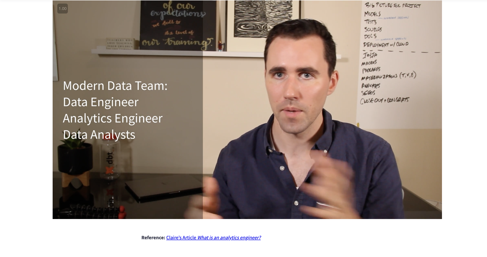

https://www.getdbt.com/what-is-analytics-engineering/

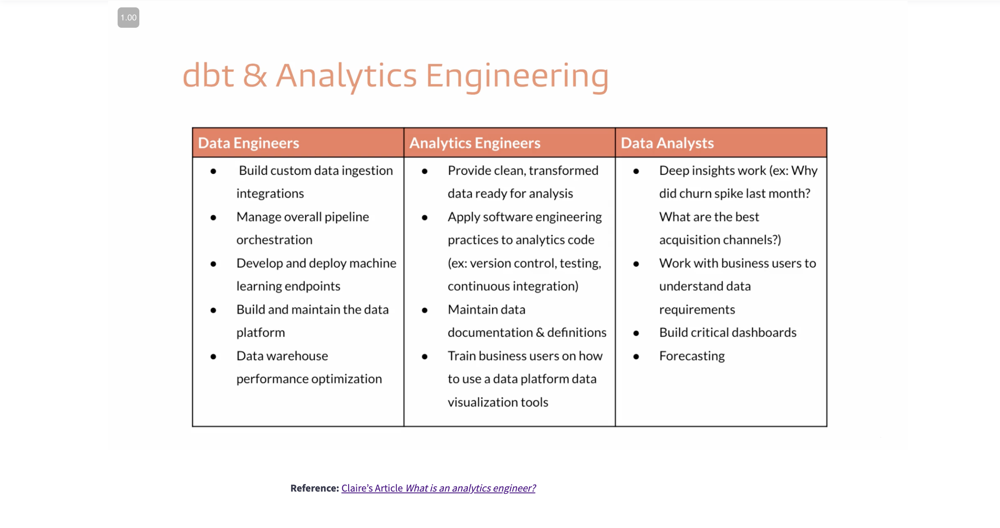

## The modern data stack and dbt

we have a lot of data source

then data platform to store all the data

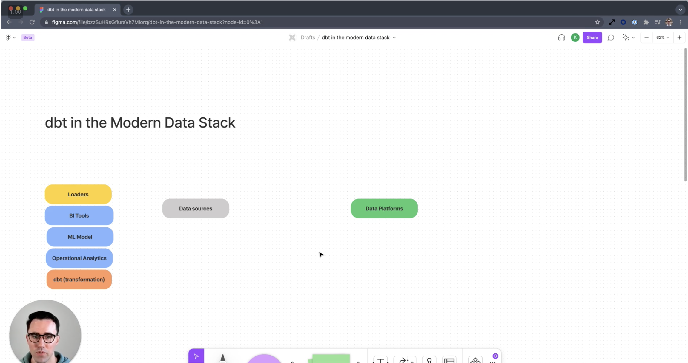

loaders to  extract data from sources (EL) to  platform
bi tools and ml models and op analytics to use the data

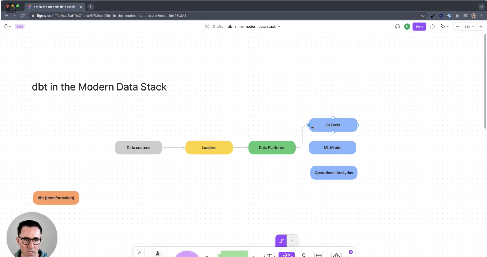

dbt fits with the data platform

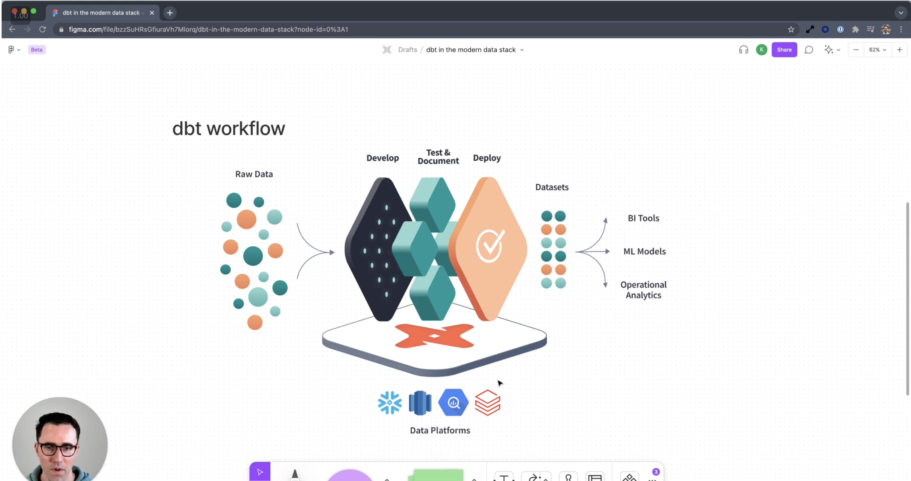

in dbt easy to develop  T to build models (only select statements)
dbt manages the dep of the models
we have DAG

then run the job to refresh the data in the platform

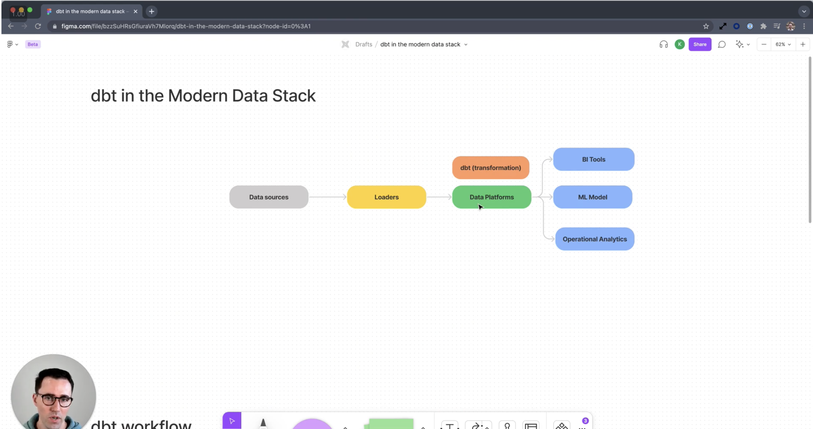

## Overview of an exemplar project

we build a project during the course

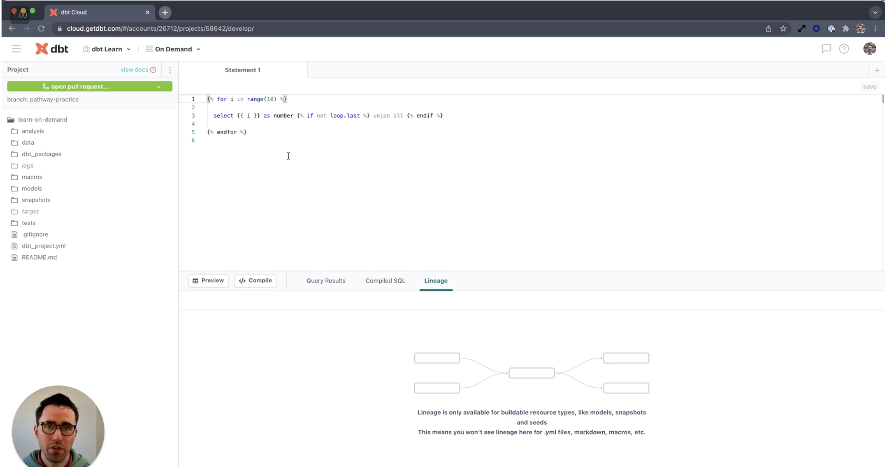

sources =  raw data
staging =  built on top of source

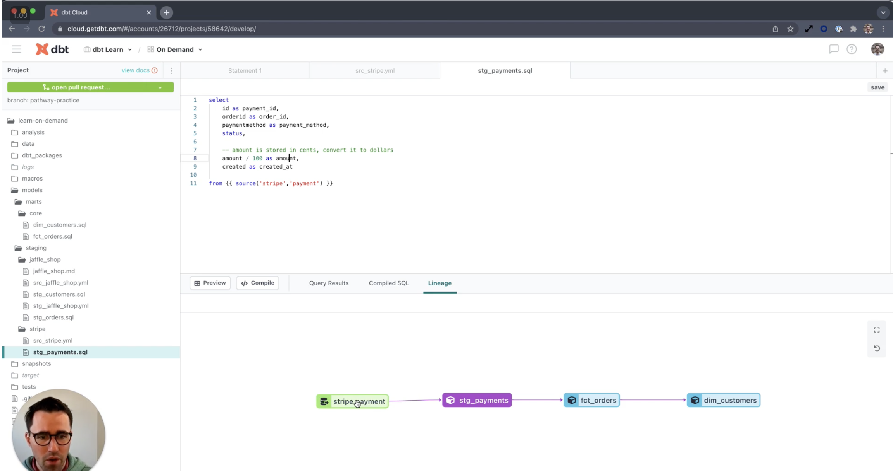

lineage = models dependencies

dbt run = build all the models in the correct order 
it send sql to  the platform to  build them and load data

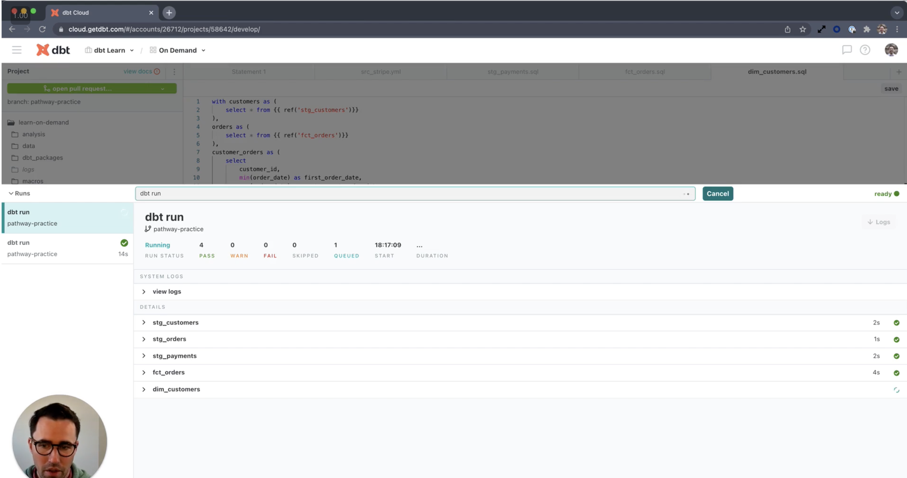

tests = to  assure data quality
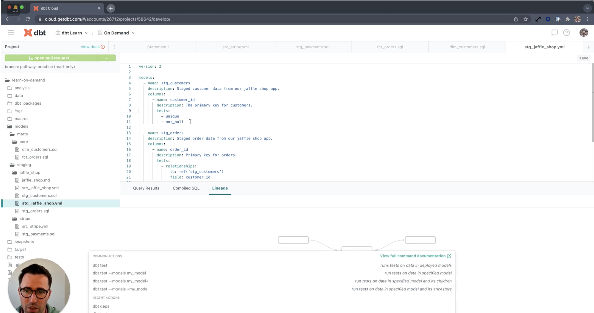

dbt creates and run them on the models

doc = description for the models 
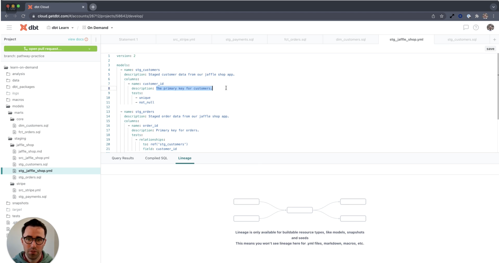

deployment =  take code and merge the code in master

use of env def to  run jobs 

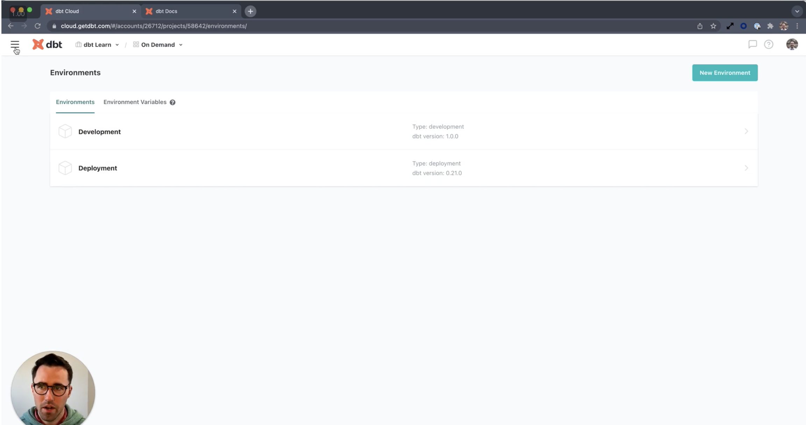

